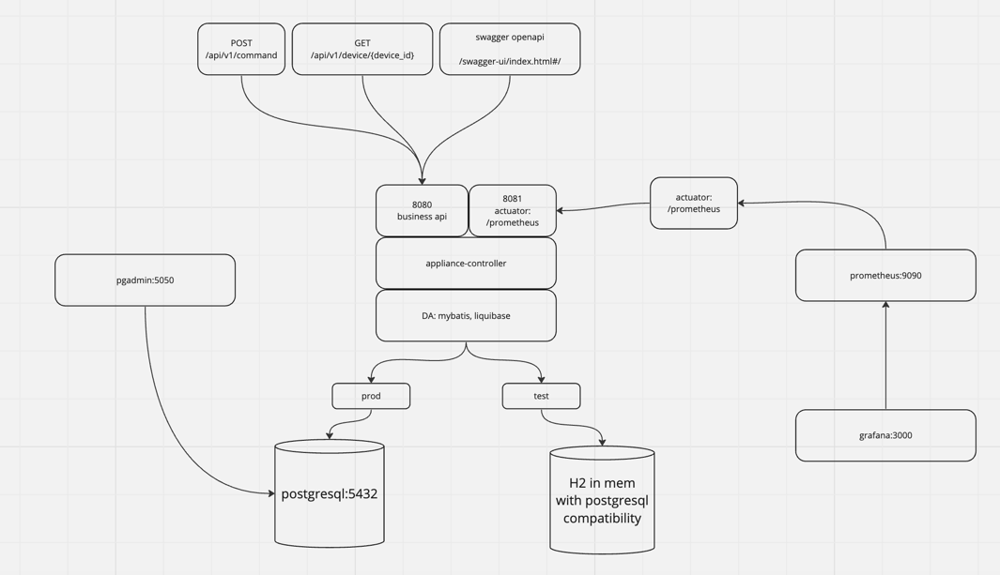
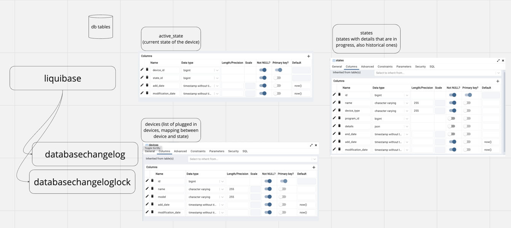

# Appliance Controller app

This app handles incoming requests to change a state of a connected physical
device and returns the current state of the device.

## Initial task

The task is to design and implement a backend service to control an appliance such as a wash machine. The API should be REST based and the state of the appliance should be persisted to any form of persistent storage. There is no need for any frontend but we expect there to be a README.md file with build directions and examples of how to invoke the REST API (e.g. curl).
The project should be implemented using Java (Spring). Feel free to use any 3rd party library that you are comfortable with. Unit tests are expected and the assignment will be assessed based on good programming practices and design.

Please use GitHub or Bitbucket to publish your source code.

## Solution

### Miro board architecture: 
https://miro.com/app/board/uXjVNVO4Ieg=/?share_link_id=390335231134

Stack:
- Java 17
- Spring Boot
- Kotlin Gradle
- PostgreSQL
- H2 for Spring Boot integration tests
- Openapi for swagger documentation
- Prometheus
- Grafana
- Docker-compose

DB tables:

### How to run it?
In order to run and test the stack, the next things are required:
1) Docker installed locally
2) `./gradlew clean build` - build the app
4) `docker-compose build` - prepare docker containers
5) `docker-compose up` - run app, postgresql, pgadmin, prometheus, grafana
6) visit: http://localhost:8080/swagger-ui/index.html#/ to check the request desctiption
7) try sending requests to /api/v1/device/{device_id}, /api/v1/device/ or /api/v1/command to see how it works.

### curl examples:

1) Send Command to Device - POST /api/v1/command

(replace the placeholders with actual values)
correlationId="your-correlation-id"
deviceId="your-device-id"
targetDeviceState="your-target-device-state"
programId="your-program-id"
details="your-details"

curl -X POST "http://your-api-host/api/v1/command" \
-H "LEMBER_CORRELATION_ID: $correlationId" \
-H "Content-Type: application/json" \
-d '{
"deviceId": '$deviceId',
"targetDeviceState": "'$targetDeviceState'",
"programId": '$programId',
"details": "'$details'"
}'

2) Get Device (GET /api/v1/device/{deviceId})

(replace the placeholders with actual values)
correlationId="your-correlation-id"
deviceId="your-device-id"

curl -X GET "http://your-api-host/api/v1/device/$deviceId" \
-H "LEMBER_CORRELATION_ID: $correlationId" \
-H "Accept: application/json"

3) Get Devices (GET /api/v1/device/)

(replace the placeholders with actual values)
correlationId="your-correlation-id"

curl -X GET "http://your-api-host/api/v1/device/" \
-H "LEMBER_CORRELATION_ID: $correlationId" \
-H "Accept: application/json"

## Another things to check
check `.env` file with all passwords and creds 
(Well, yeah, it's not a good practice to expose such files in the repo. However, I've decided to do it just to simplify the work of the code reviewer)

* visit grafana: http://localhost:3000/ to check the metrics

* visit prometheus: http://localhost:9090/ to check the targets

* visit pgadmin: http://localhost:5050/ to check the DB state

## How did I setup Grafana?

I took a common image `grafana/grafana`, setup data source as prometheus
manually, then set up a dashboard with 2 widgets, displaying
`command` and `device` requests rate.

After that I stopped a container, did a commit
`docker commit your_existing_grafana_container jennylember-grafana-for-appliance-controller:latest`

then tagged:
`docker tag jennylember-grafana-for-appliance-controller:latest jennylember/jennylember-grafana-for-appliance-controller:latest`

and pushed to my own dockehub (https://hub.docker.com/u/jennylember):
`docker push jennylember/jennylember-grafana-for-appliance-controller`

Maybe there is a better way how to do this setup in a declarative way with a config file,
need to make research.

## Further improvements

### Technical
1) using `openapi gradle plugin` to generate API entities and controller interfaces
   (check `appliance-api.yml` file as an example, but it's not used)
2) store passwords in `vault` or at least to use `git-crypt` locally
3) add authentication to the http controller
4) review concurrent tables update
5) add more widgets to grafana, to check `RPS`, `latency`, `errors`
6) use `MDC` to store correlation_id from the header to get access for it in all logs 

### Business
1) extend the DB tables and properties so that different device types are
truly supported (now it is only `WASHING_MACHINE` device type)
2) devices state history is stored now in `states` table, but it is impossible to 
link the old historical data to real devices. A `device_id` column should be added.
3) check `CommandRequest.WashingDetails` more carefully.
Make different implementations for this interface type Details.
Check if the program may support flags from `WashingDetails` by 
checking `CommandRequest.programId` in the app properties.
4) Make a "mock listener" imitating sending the commands from the washing machine
so that the transition between states will be automatic. Also,
improve `StateTransitions` class to support automatic transitions 

